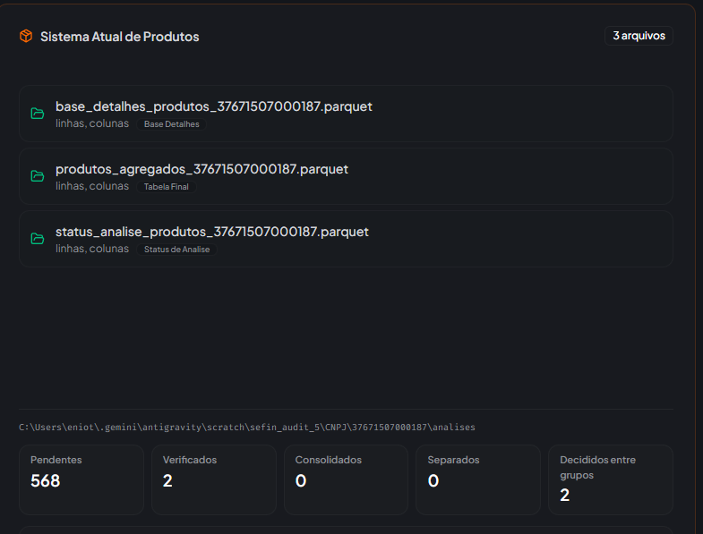
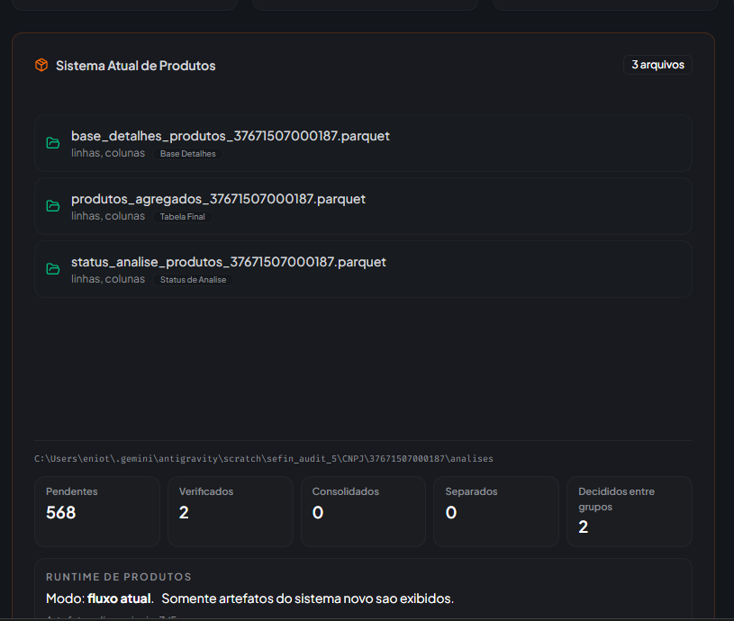

# **Fluxo: Separação e Consolidação de Códigos**

**Versão Revisada com Saneamento**

Este documento detalha o processo de padronização de registros fiscais, visando a eliminação de duplicidades e o tratamento de inconsistências cadastrais através de normalização e análise técnica.

## **1\. Mapeamento de Campos Fiscais (Base: tabela\_produtos)**

A base inicial deve ser consolidada a partir das fontes **NFe**, **NFCe**, **C170** e **Bloco H**.

| Campo Canónico | NFe | NFCe | C170 | Bloco H |
| :---- | :---- | :---- | :---- | :---- |
| **Codigo** | prod\_cprod | prod\_cprod | cod\_item | codigo\_produto |
| **Descricao** | prod\_xprod | prod\_xprod | descr\_item | descricao\_produto |
| **Descr\_compl** | (vazio) | (vazio) | descr\_compl | (vazio) |
| **Tipo\_item** | (vazio) | (vazio) | tipo\_item | tipo\_item |
| **NCM** | prod\_ncm | prod\_ncm | cod\_ncm | cod\_ncm |
| **CEST** | prod\_cest | prod\_cest | cest | cest |
| **GTIN** | prod\_cean | prod\_cean | cod\_barra | cod\_barra |

## **Fase 0: Saneamento e Normalização (Pré-processamento)**

Limpeza técnica dos dados brutos para garantir uniformidade antes da agregação.

### **0.1 Normalização de Descrições**

* **Caixa e Acentos:** Converter para MAIÚSCULAS e remover acentos (ex: "Água" → "AGUA").  
* **Limpeza de Ruído:** Remover caracteres especiais e *stopwords* (artigos, preposições como "de", "com", "para").  
* **Estruturação:** Separar nitidamente a descrição principal da complementar (descr\_compl).  
* **Tokenização:** Quebrar a string em termos (tokens) para facilitar comparações.  
* **Chave Única:** Criar a coluna descrição\_normalizada para servir de chave de agrupamento.

### **0.2 Padronização de Unidades e Medidas**

* Converter siglas para o padrão (ex: "UN", "UND", "UNID" → "UN"; "PEÇA", "PÇ" → "PC").  
* Utilizar tabela de sinônimos controlados (ex: "KG" e "QUILO" \= mesma interpretação).

### **0.3 Validação de Campos Fiscais**

* **GTIN:** Validar comprimento (8, 12, 13 ou 14 dígitos) e dígito verificador.  
* **NCM:** Validar se possui exatamente 8 dígitos (conforme Receita Federal).  
* **CEST:** Validar se possui exatamente 7 dígitos numéricos.

## **Fase 1: Agregação Inicial**

Identificação do panorama geral dos produtos a partir da base saneada.

### **1.1 Tabela Base (tabela\_descricoes\_unificadas)**

* **Critério:** Agrupar registros com descrição\_normalizada **exatamente iguais**.  
* **Campos Gerados:**  
  * codigo\_padrao, lista\_codigos, lista\_tipo\_item, lista\_ncm, lista\_cest, lista\_gtin, lista\_unid.  
  * tipo\_item\_padrao, NCM\_padrao, CEST\_padrao, GTIN\_padrao.  
  * verificado (booleano: true/false).  
* **Formato de lista\_codigos:** \[código; nº\_de\_descrições\_diferentes\] (Ex: \[234; 2\]).

### **1.2 Definição do Código Padrão**

1. **Frequência:** O código que mais se repete no grupo.  
2. **Desempate por Integridade:** Código com preenchimento mais completo (Tipo Item \> GTIN \> NCM \> CEST).  
3. **Movimentação:** Data de venda/entrada mais recente.  
4. **Antiguidade:** Menor valor numérico (ID original).

## **Fase 2: Identificação de Divergências**

Tratamento de códigos vinculados a descrições diferentes.

* **Separação:** Se o código 123 possui duas descrições distintas, criam-se novos códigos (ex: 123\_separado\_01 e 123\_separado\_02).  
* **Descontinuação:** O código original (123) é eliminado da estrutura final.  
* **Nova Estrutura:** Criar tabelas\_descricoes\_unificadas\_desagregada. Aqui, a lista\_codigos contém apenas o código individual, pois cada registro terá apenas uma descrição.

## **Fase 3: Tratamento e Atualização (Análise do Usuário)**

| Cenário | Ação |
| :---- | :---- |
| **A) Diferenças Reais** | Itens fisicamente distintos: **Manter separação**. |
| **B) Variações de Texto** | Mesmo produto com escrita diferente: **Consolidar no codigo\_padrao** e usar a descrição\_normalizada oficial. |

### **Regra de Ouro para Consolidação**

Os produtos unificados devem herdar as características padrão (tipo\_item\_padrao, etc.) baseadas nos valores mais comuns, ignorando nulos (exceto se nulo for a única opção).

## **Anexo: Tipos de Item (Guia de Referência)**

* **00** – Mercadoria para Revenda  
* **01** – Matéria-prima  
* **02** – Embalagem  
* **03** – Produto em Processo  
* **04** – Produto Acabado  
* **05** – Subproduto  
* **06** – Produto Intermediário  
* **07** – Material de Uso e Consumo  
* **08** – Ativo Imobilizado  
* **09** – Serviços  
* **10** – Outros insumos  
* **99** – Outras