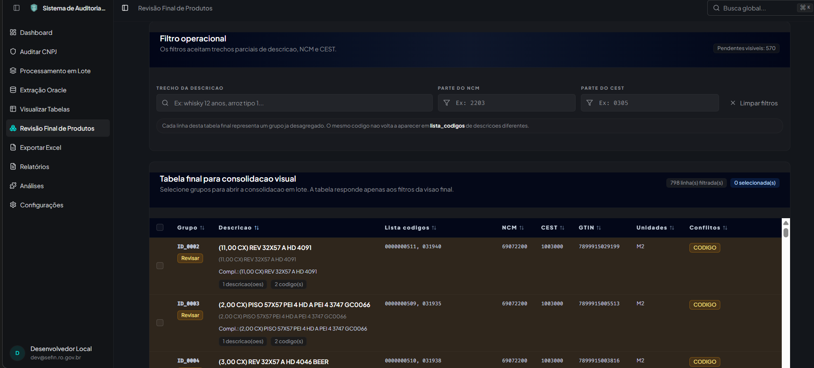

# Produtos: Visão Geral

Objetivo: Consolidar códigos, descrições e atributos de produtos de fontes distintas (NFe/NFCe, SPED C170/0200), gerando um produto master por chave_produto com NCM/CEST de consenso e suporte à revisão manual.

## Artefatos Principais
- produtos_agregados_{cnpj}.parquet
- base_detalhes_produtos_{cnpj}.parquet
- mapa_produto_nfe_{cnpj}.parquet
- mapa_produto_0200_{cnpj}.parquet
- mapa_auditoria_{cnpj}.parquet

## Integrações
- Endpoints /api/python/produtos/* para revisão manual e unificação
- Endpoints /api/python/referencias/ncm|cest para consulta de dados referenciais
- Pipelines em `server/python/routers/analysis.py` e `server/python/routers/produto_unid.py`

## Fluxo de Alto Nível
```
NFe/NFCe + SPED 0200 → Mapas por fonte → Unificação Master → Revisão Manual → Aplicar Unificações → Mapas/Auditoria
```

## Mapeamento de Campos por Fonte

Tabela baseada no runtime atual em `server/python/core/produto_runtime.py`, funcao `_carregar_base_detalhes`, que normaliza cada origem para a base canonica de detalhes.

| Campo canonico | NFe | NFCe | C170 | Bloco H | Observacao |
|------|------|------|------|------|------|
| `Codigo` | `prod_cprod` | `prod_cprod` | `cod_item` | `codigo_produto` | Campo minimo obrigatorio para a linha entrar na base de detalhes. |
| `Descricao` | `prod_xprod` | `prod_xprod` | `descr_item` | `descricao_produto` | Campo minimo obrigatorio para a linha entrar na base de detalhes. |
| `Descr_compl` | `(vazio)` | `(vazio)` | `descr_compl` | `(vazio)` | Quando a fonte nao fornece a coluna, o runtime grava string vazia. |
| `Tipo_item` | `(vazio)` | `(vazio)` | `tipo_item` | `tipo_item` | NFe/NFCe nao populam `tipo_item` no mapeamento atual. |
| `NCM` | `prod_ncm` | `prod_ncm` | `cod_ncm` | `cod_ncm` | Normalizado como texto. |
| `CEST` | `prod_cest` | `prod_cest` | `cest` | `cest` | Normalizado como texto. |
| `GTIN` | `prod_cean` | `prod_cean` | `cod_barra` | `cod_barra` | Passa por saneamento via `_clean_gtin`. |

Observacoes tecnicas:
- `NFe` e `NFCe` usam o mesmo layout de mapeamento no runtime atual.
- Se `Codigo` ou `Descricao` vierem vazios, a linha e descartada antes de entrar em `base_detalhes_produtos_{cnpj}.parquet`.
- O fluxo novo parte apenas de `NFe`, `NFCe`, `C170` e `Bloco H`, como definido em `documentacao/Fluxo de Consolidação de Produtos.md`.

### Campos da Tabela Master de Produtos (produtos_agregados_{cnpj}.parquet)

Campos gerados por `cruzamentos/produtos/produto_unid.py` (função `UnificadorProdutos.construir_plano_mestre`):

| Campo | Tipo | Descrição |
|------|------|-----------|
| `chave_produto` | string | Identificador master no formato `codigo_tipo_item` (combina o código original ao tipo de item). |
| `lista_descricao` | string (lista joinada por ` | `) | Todas as variações de descrição encontradas para a identidade (código+tipo_item). |
| `lista_codigos` | string (lista joinada por `, `) | Todos os códigos originais que mapearam para esta identidade (rastreabilidade). |
| `cods_descr` | string (lista joinada por `, `) | Identificadores formatados de ambiguidade: `[codigo:tipo_item; qtd_descr_distintas]`. |
| `requer_revisao_manual` | boolean | Flag indicando conflito de descrições, demandando revisão manual. |
| `descricoes_conflitantes` | string (lista joinada por ` | `) | Descrições conflitantes com frequências. Ex.: `[descricao; freq]`. |
| `ncm_consenso` | string | Valor mais frequente (moda) de NCM entre as fontes, após revisões aplicadas. |
| `cest_consenso` | string | Valor mais frequente (moda) de CEST. |
| `gtin_consenso` | string | Valor mais frequente (moda) de GTIN (após sanitização e validação de tamanho 8/12/13/14). |
| `tipo_item_consenso` | string | Tipo do item mais frequente (principalmente a partir do Reg. 0200, quando disponível). |
| `lista_ncm` | string (lista joinada por `, `) | Todos os NCMs originais observados na identidade. |
| `lista_cest` | string (lista joinada por `, `) | Todos os CESTs originais observados. |
| `lista_gtin` | string (lista joinada por `, `) | Todos os GTINs originais observados (limpos). |
| `lista_descr_compl_c170` | string (lista joinada por ` | `) | Todas as descrições complementares do C170. |
| `lista_unid` | string (lista joinada por `, `) | Todas as unidades de medida associadas. |
| `lista_tipo_item` | string (lista joinada por `, `) | Todos os tipos de item observados (ex.: 00, 01, (Vazio)). |
| `lista_fonte` | string (lista joinada por `, `) | Fontes de origem: Bloco H, C170+0200, NFe, NFCe. |

Observações técnicas:
- A `chave_produto` é formada no final do pipeline como `codigo + '_' + tipo_item`. Exemplo: `12345_00`.
- As colunas `lista_*` resultam de agregações com `list.join()` para facilitar leitura e exportação (CSV/Excel).
- A sinalização `requer_revisao_manual = true` depende da detecção de conflito de descrições por identidade.
- Revisões manuais (`mapa_manual_unificacao_{cnpj}.parquet`) são aplicadas antes do agrupamento para que consenso e flags reflitam correções do auditor.

## Leitura Recomendada
- [DADOS_REFERENCIAIS.md](./DADOS_REFERENCIAIS.md)
- [PIPELINE_PRODUTOS.md](./PIPELINE_PRODUTOS.md)
- [PROPOSTA_VETORIZACAO_OPCIONAL.md](./PROPOSTA_VETORIZACAO_OPCIONAL.md)
- [API_SCRIPTS.md](./API_SCRIPTS.md)
- [TROUBLESHOOTING.md](./TROUBLESHOOTING.md)
